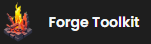
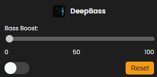
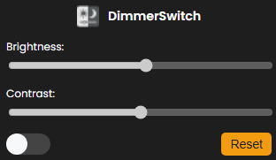

# Forge-Toolkit

Forge-Toolkit is a browser extension that offers a suite of modular tools for web customization. Currently, it includes two useful tools: **DimmerSwitch** and **DeepBass**.

## Overview

Forge-Toolkit is perfect for users looking to enhance their browsing experience with practical and efficient tools. With a user-friendly interface, you can easily access the available functionalities.

---

## Available Tools

### DeepBass

DeepBass is a browser extension that allows you to enhance the bass while listening to music on any website, improving your audio experience.

### DimmerSwitch

DimmerSwitch is a browser extension that allows you to control the brightness and contrast of any website, enhancing your browsing experience.

---

## Status

- **Current Version**: 1.0
- **Development Status**: Work in progress! We are continuously working on improving the extension and adding new features.

---

## Team

- Guilherme Andrade [@adr-g](https://github.com/adr-g)
- André Silva [@andresilva669](https://github.com/andresilva669)

---

> ## License
>
> This project is licensed under the GNU Affero General Public License v3.0 (AGPL-3.0).
>
> You are free to use, copy, modify, and distribute this software, provided that:
> - Any modifications or derivative works are also licensed under the AGPL v3.0.
> - If you make the software available over a network, the source code must also be made available to users.
>
> See the [LICENSE](LICENSE) file for the full license text or visit:  
> [https://www.gnu.org/licenses/agpl-3.0.html](https://www.gnu.org/licenses/agpl-3.0.html)
